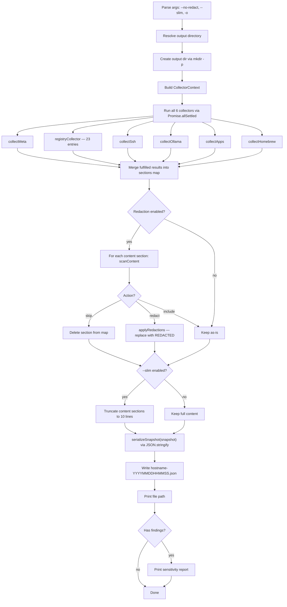
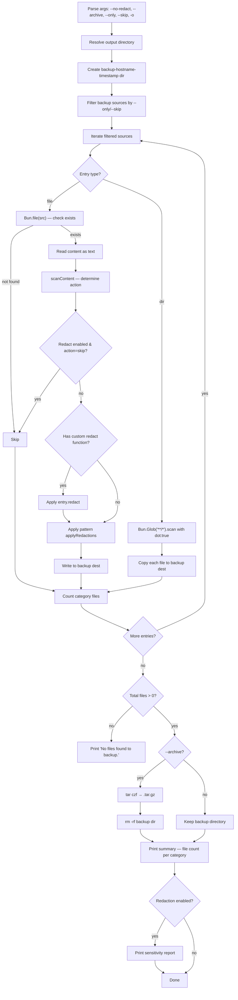
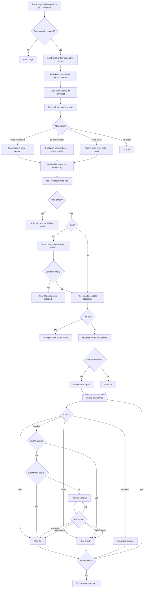
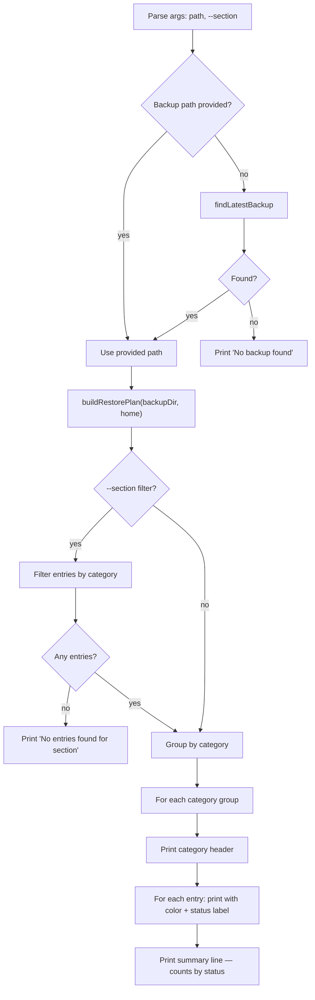
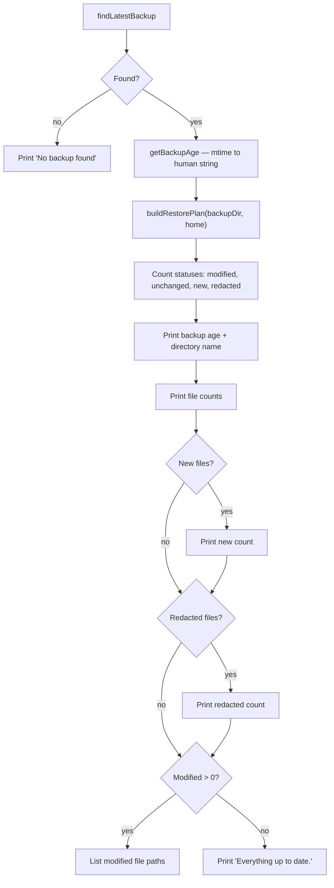
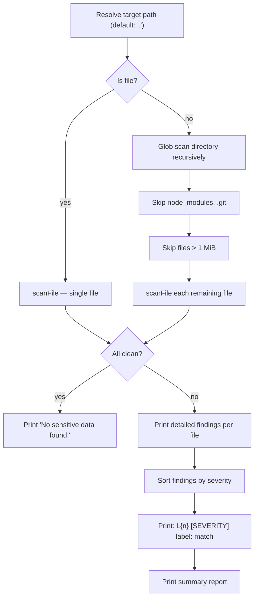
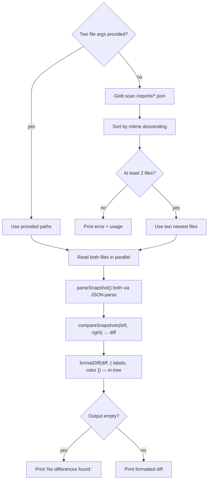
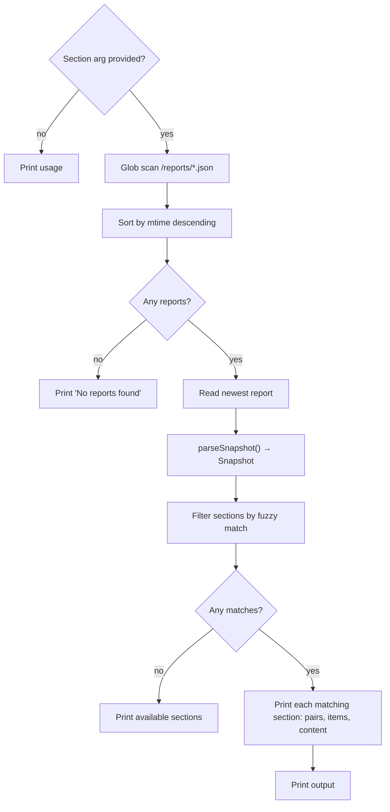

# Execution Flows

Runtime behavior of each major command, visualized with Mermaid diagrams.

## `collect` Flow

## `backup` Flow

## `restore` Flow

## `diff` Flow

## `status` Flow

## `scan` Flow

## `compare` Flow

## `list` Flow

